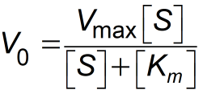
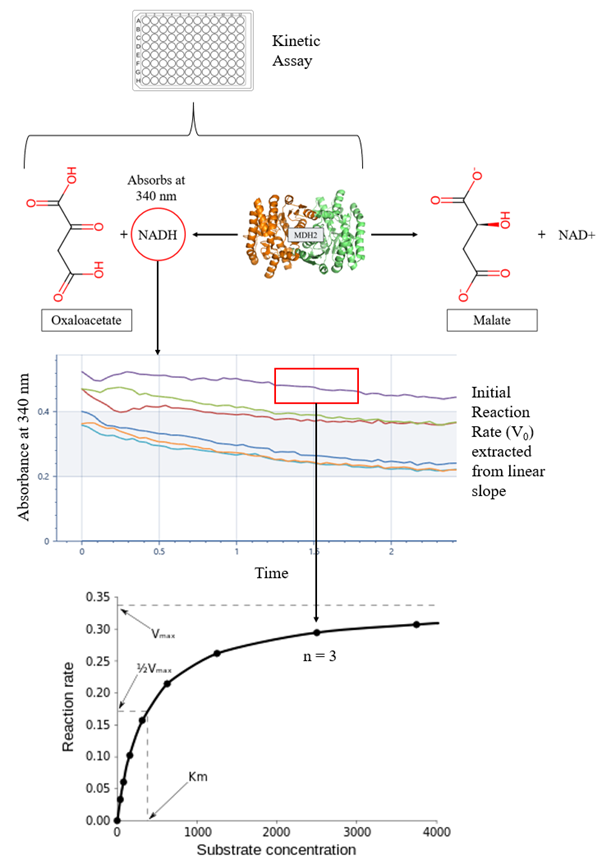
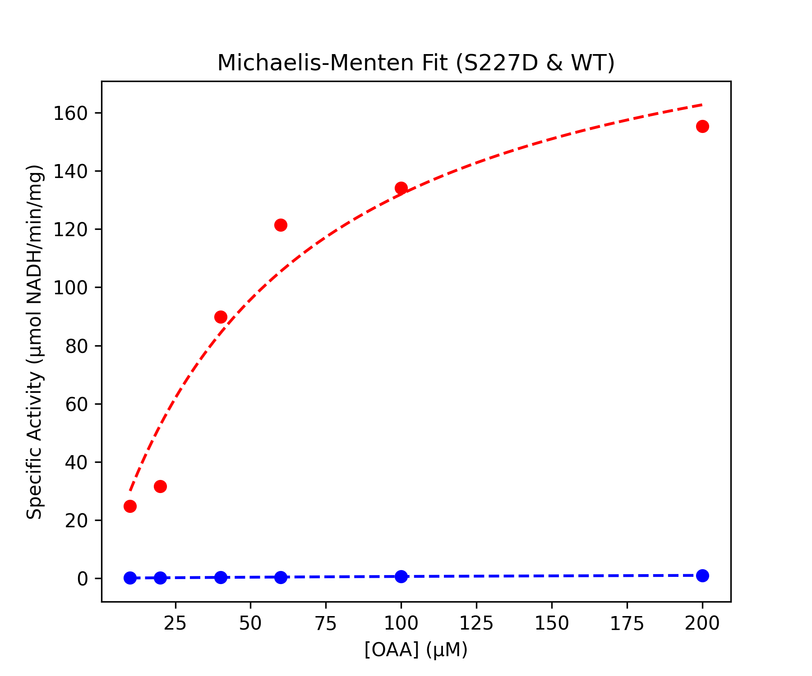
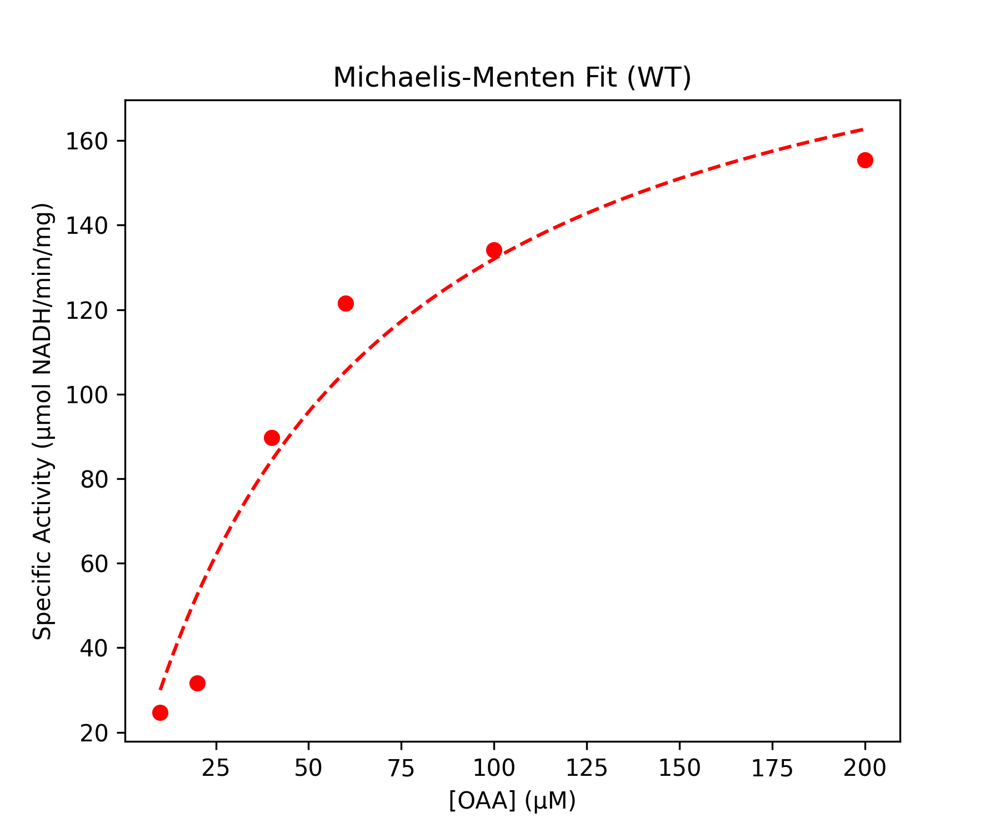
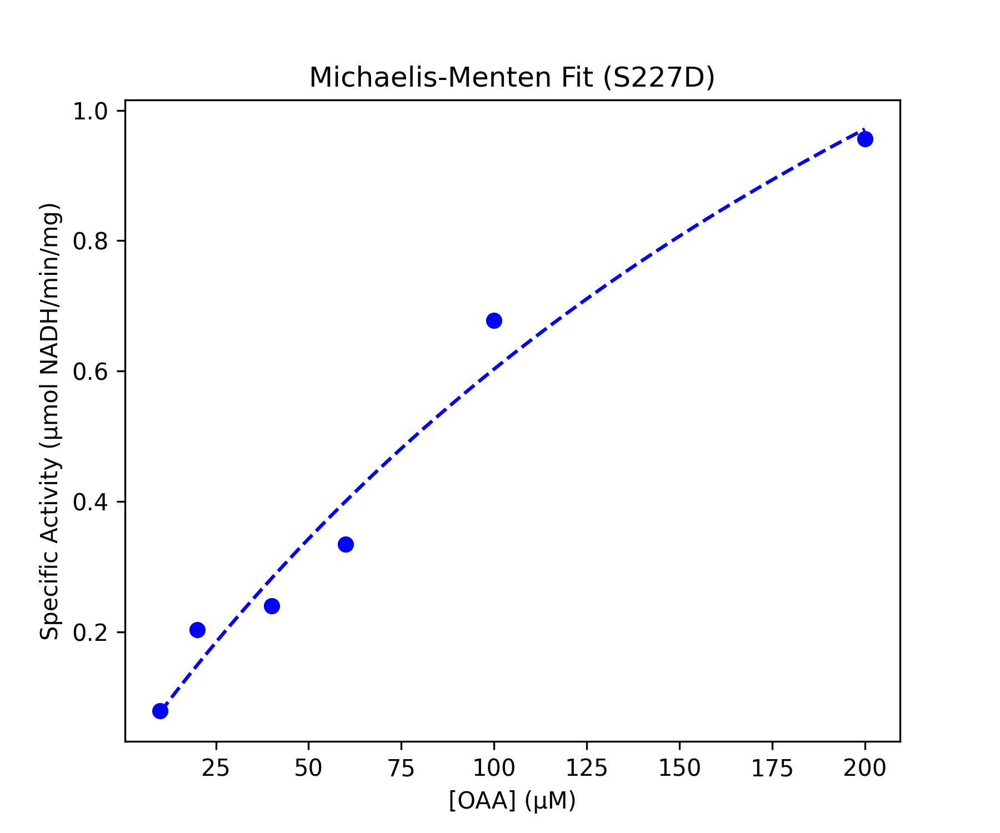
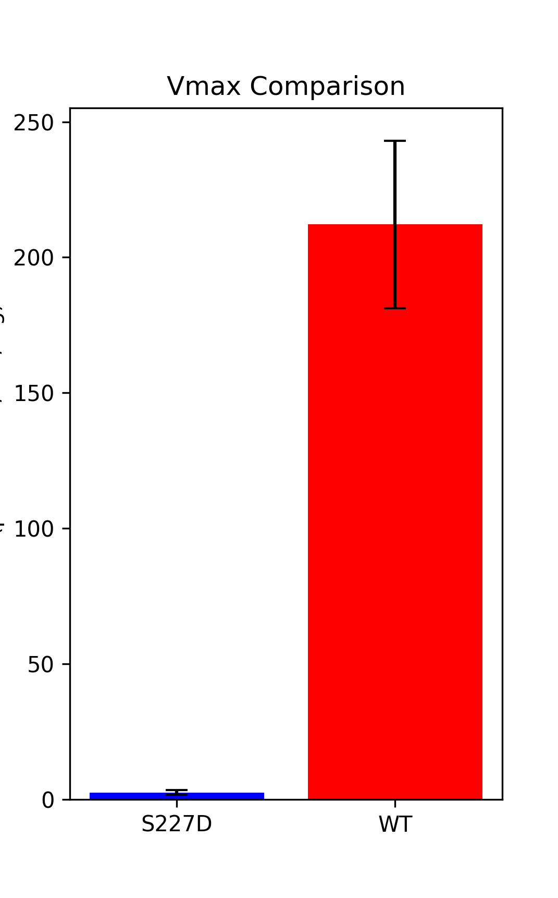

# Automation of Michaelis-Menten Kinetic Analysis for Malate Dehydrogenase Datasets

Author: Emily Rose Friedman

---

## Abstract

My St. Mary’s Project explores phosphorylation as a regulatory strategy for malate dehydrogenase (MDH) via the kinetic characterization of a novel phosphomimetic mutant; S227D. Towards this enzymatic analysis I collected kinetic rate datasets for both wildtype (WT) and S227D MDH for direct comparison. These data encompass the reaction curves of the enzymes with varying concentrations of the substrate OAA, measuring the consumption of the cofactor NADH via a decrease in absorbance (340nm) over time. The custom python scripts outlined here proved successful in automating the analysis of this data according to the Michaelis-Menten kinetics model to extract relevant kinetic parameters; a process that is commonly computed by hand. This included the identification of linear regions in assay data, the fitting of linear regressions to extract V0 for each OAA concentration, conversion to specific activity values, and nonlinear curve fitting to obtain Vmax and Km values, as well as the generation of Michaelis-Menten plots for both enzymes.

---

## Introduction

For my St. Mary’s project, I have collected series of kinetic rate data for both wildtype malate dehydrogenase (MDH) and a novel phosphomimetic MDH mutant: S227D. This data encompasses the reaction curves of the enzymes with varying concentrations of substrate OAA by measuring the consumption of the cofactor NADH by decreasing absorbance (340nm) over the course of the reaction. The most common approach to statistically determine and compare the kinetic parameters of enzymes is through Michaelis-Menten Kinetics, which enzymatic reactions involving a single substrate can be assumed to follow.

The curve expressing the relationship between the initial substrate concentration [S], and the initial reaction velocity V0 has a characteristic rectangular hyperbolic shape for such enzymes, which can be stated mathematically by the Michaelis-Menten equation:



This equation demonstrates that the initial velocity V0, the maximum velocity Vmax, and the initial substrate concentration [S] are all related quantitatively through the Michaelis constant Km. These parameters can be readily measured experimentally by running a series of enzyme assays at varying substrate concentrations and extracting the initial reaction rates (V0); which can be found in the linear portion of the data at the beginning of an assay where [S] can be regarded as constant. The parameters Vmax (the maximum rate at which an enzyme can catalyze product formation), and Km (The substrate concentration at which ½ Vmax is achieved), can then be directly derived from Michaelis-Menten plot via nonlinear regression. Nonlinear curve-fitting is the preferred method for calculation of kinetic parameters, as it avoids error propagation in lower substrate concentrations that is prevalent in a traditional double-reciprocal transformations of the data (Lineweaver-Burk plots) which are commonly employed in manual calculations of kinetic parameters.



Manual performance of this pipeline can introduce other substantial errors. Traditionally, each assay is visually assessed for perceived linear regions; for which the range is then selected by hand. Many select the first linear region at the beginning of the assay, which is often steeper than the true initial reaction velocity. Additionally, these manual region selections do not optimize for goodness of fit when performing linear regressions, which could hurt downstream analyses such as the goodness of fit for the Michaelis-Menten curve itself. With these shortcomings in mind, I sought to optimize the Michaelis-Menten analysis pipeline by identifying low-curvature linear regions based on second derivatives to maximize goodness-of-fit, and to apply nonlinear curve-fitting to these more accurate reaction rates.

---

## Methods & Results

This pipeline consists of two primary Python programs:

- `michaelis_menten_kinetics.py`: formats and processes pathlength-corrected absorbance vs. time data, identifies linear regions of data, computes initial velocities, and converts them to specific activity which are then averaged across replicates.
- `fit_michaelis_menten.py`: Fits data to Michaelis-Menten equation, computes Vmax and Km values with standard error, and generates plots.

---

### `michaelis_menten_kinetics.py` 
[View michaelis_menten_kinetics.py](./wt500_michaelis_menten_kinetics.py)

#### Step 1. Loading and formatting data

[Wildtype data](./WT_pathcorrected_OAA_ph8_dil500.xlsx)

[Mutant data](./S227D_pathcorrected_OAA_ph8.xlsx)

- Each excel file contains 7 sheets, each corresponding to a substrate concentration.
- Load into dictionaries where each key is the substrate concentration (sheet name), and the value is a the associated dataframe:

```python
# Read excel files into dictionaries
dict_s227d = pd.read_excel(xls_s227d, sheet_name = xls_s227d.sheet_names[0:7])
dict_wt = pd.read_excel(xls_wt, sheet_name = xls_wt.sheet_names[0:7])
```

- Retain only time and absorbance data for the 3 replicates
- Rename columns to make downstream coding easier

```python
for sheet_name, df in dict_s227d.items():
    df = df.iloc[:, 1:5]  # Keep only columns 2 to 5
    df.columns = ["Time", "s227d_R1", "s227d_R2", "s227d_R3"]  # Rename columns
    dict_s227d[sheet_name] = df  # Update the dictionary

for sheet_name, df in dict_wt.items():
    df = df.iloc[:, 1:5]
    df.columns = ["Time", "wt_R1", "wt_R2", "wt_R3"]
    dict_wt[sheet_name] = df
```
---
#### Step 2. Calculate Derivatives
`def process_sheets(xls, sample_prefix):`
This function:
1.	Loops over each sheet in each Excel file.
2.	Calculates for each replicate:
- First derivative (dA/dt): Represents reaction rate over time.
- Second derivative (d²A/dt²): Measures curvature → helps find regions that are linear.

`np.gradient` numerically estimates derivatives using finite differences.

```python
# Function to compute derivatives
	# second derivative will be used to help find best linear region
def process_sheets(xls, sample_prefix):
    dict_data = pd.read_excel(xls, sheet_name=None)  # Read all sheets
    processed_dict = {}

    for sheet_name, df in dict_data.items():
        df = df.iloc[:, 1:5]  # Keep only relevant columns
        df.columns = ["Time", f"{sample_prefix}_R1", f"{sample_prefix}_R2", f"{sample_prefix}_R3"]

        # first derivative
        df[f"dA_dt_R1"] = np.gradient(df[f"{sample_prefix}_R1"], df["Time"])
        df[f"dA_dt_R2"] = np.gradient(df[f"{sample_prefix}_R2"], df["Time"])
        df[f"dA_dt_R3"] = np.gradient(df[f"{sample_prefix}_R3"], df["Time"])

        # second derivative
        df[f"d2A_dt2_R1"] = np.gradient(df[f"dA_dt_R1"], df["Time"])
        df[f"d2A_dt2_R2"] = np.gradient(df[f"dA_dt_R2"], df["Time"])
        df[f"d2A_dt2_R3"] = np.gradient(df[f"dA_dt_R3"], df["Time"])

        processed_dict[sheet_name] = df  # Store processed dataframe

    return processed_dict

# Processed data with derivatives
dict_s227d_processed = process_sheets(xls_s227d, "s227d")
dict_wt_processed = process_sheets(xls_wt, "wt")
```
---
#### Step 3. Define constants for specific activity calculations
- Used to calculate concentration from absorbance (Beer's law) and normalize for enzyme amounts in assay

```python
# Constants to be used in specific activity calculations
NADH_concentration = 0.0322  # concentration in umol of the absorbing species (c) from Beer's law

# mg of enzyme in 20ul
enzyme_amount_s227d = 0.0086666675  
enzyme_amount_wt = 0.00001592258262  # 1:500 dilution
```
#### Step 4. Function to find best linear region
```python
def find_best_linear_region(df, rate_col, second_deriv_col, time_col="Time", window_size=5):
```
- df: DataFrame with absorbance and derivative data.
- rate_col: Column of absorbance values for a replicate.
- second_deriv_col: Column with second derivative (used to identify flat regions).
- time_col: Time column (default is "Time").
- window_size: Number of consecutive points to include in linear regression (must be ≥ 5).

```python
threshold = np.percentile(np.abs(df[second_deriv_col]), 20)
```
- Sets a dynamic threshold using the 20th percentile of the absolute second derivative.
- Identifies regions with low curvature, which are likely to be linear.

```python
linear_region_mask = np.abs(df[second_deriv_col]) < threshold
linear_indices = np.where(linear_region_mask)[0]
```
- Applies the threshold to identify all low-curvature index positions in the dataset

```python
if len(linear_indices) < window_size: 
    print(f"Warning: Not enough low-curvature points for {rate_col}.")
    return None, None, None, None
```
- Checks that enough points are available to perform a good regression.

```python
best_slope, best_r2, best_start_idx, best_end_idx = None, 0, None, None
```
- Initializes tracking variables for the best fit region found so far.
- Based on negative slope and highest R2 value

```python
for start_idx in range(len(linear_indices) - window_size):
```
- Slide a window of size `window_size` across `linear_indices`.

```python
    end_idx = start_idx + window_size
    time_linear = df[time_col].iloc[linear_indices[start_idx:end_idx]]
    absorbance_linear = df[rate_col].iloc[linear_indices[start_idx:end_idx]]
```
- Define the window range and extract time and absorbance values just within that window.

```python
    slope, intercept, r_value, p_value, std_err = linregress(time_linear, absorbance_linear)
```
- Perform linear regression over the window.
Returns:
- slope: the velocity (V₀) estimate
- r_value**2: coefficient of determination (R²) for goodness of fit

```python
  if slope < 0 and r_value**2 > best_r2:
        best_slope, best_r2 = slope, r_value**2
        best_start_idx, best_end_idx = linear_indices[start_idx], linear_indices[end_idx - 1]
```
- Only fits with negative slope and better R2 than previous fits are accepted.
- If both conditions met store as current best fit

```python
if best_slope is not None:
    return abs(best_slope), best_start_idx, best_end_idx, best_r2
```
- If a valid best slope was found, return: best slope (V0), region of time chosen, and R2
---
#### Step 4. Calculate specific activity from best linear region
```python
# Dictionaries to store the average specific activity for each substrate concentration
averaged_specific_activity_s227d = {}
averaged_specific_activity_wt = {}

# Loop through each enzyme (S227D and WT)
for enzyme_dict, enzyme_name, enzyme_amount, averaged_specific_activity in zip(
    [dict_s227d_processed, dict_wt_processed], 
    ["S227D", "WT"], 
    [enzyme_amount_s227d, enzyme_amount_wt], 
    [averaged_specific_activity_s227d, averaged_specific_activity_wt]
):
    for sheet_name, df in enzyme_dict.items():
        substrate_concentration = sheet_name
        specific_activities = []
        
        # Loop through each replicate (R1, R2, R3)
        for replicate in [f"{enzyme_name.lower()}_R1", f"{enzyme_name.lower()}_R2", f"{enzyme_name.lower()}_R3"]:
            
            # Step 1: Find the best linear region for V₀ determination
            best_slope, best_start_idx, best_end_idx, min_second_derivative = find_best_linear_region(
                df,
                replicate,  # First derivative column (e.g., "s227d_R1", "wt_R1", etc.)
                f"d2A_dt2_{replicate[-2:]}"  # Second derivative column (e.g., "d2A_dt2_R1", "d2A_dt2_R2", etc.)
            )
            
            # Step 2: Calculate V₀ in abs/sec (slope from linear region)
            if best_slope is not None:
                V0 = abs(best_slope)  # The magnitude of the slope gives the initial velocity (abs/sec)
                print(f"V₀ for {replicate} in {sheet_name}: {V0:.6f} abs/sec")
                print(f"Linear region: Time from {df['Time'].iloc[best_start_idx]} to {df['Time'].iloc[best_end_idx]} (seconds)")
                
                # Step 3: Convert V₀ to specific activity (µmol NADH/min/mg)
                enzyme_units = ((V0 * 60) * NADH_concentration) # convert abs/sec to abs/min before multiplying by c
                specific_activity = (enzyme_units / enzyme_amount)
                
                print(f"Specific Activity for {replicate} in {sheet_name}: {specific_activity:.4f} µmol NADH/min/mg")
                
                # Step 4: Store specific activity for averaging
                specific_activities.append(specific_activity)
            else:
                print(f"No valid linear region found for {replicate} in {sheet_name}")
        
        # Step 5: Calculate and store the average specific activity for substrate concentration
        if specific_activities:
            averaged_specific_activity[substrate_concentration] = np.mean(specific_activities)
        else:
            averaged_specific_activity[substrate_concentration] = None

# DataFrame for averaged specific activities
df_s227d = pd.DataFrame(list(averaged_specific_activity_s227d.items()), columns=["Substrate Concentration", "Average Specific Activity (S227D)"])
df_wt = pd.DataFrame(list(averaged_specific_activity_wt.items()), columns=["Substrate Concentration", "Average Specific Activity (WT)"])

# Merge the S227D and WT DataFrames on the "Substrate Concentration" column
df_combined = pd.merge(df_s227d, df_wt, on="Substrate Concentration", how="outer")

# Save DataFrame as CSV
df_combined.to_csv("averaged_specific_activity_wt500.csv", index=False)

print("Averaged Specific Activities saved successfully!")
```
### `fit_michaelis_menten.py` 
[View fit_michaelis_menten.py](./fit_michaelis_menten.py)
```python
# Load excel file with average specific activity
df = pd.read_excel(f"{file_dir}avg_specific_activity_ex0.3.xlsx")

# Extract data
OAA_conc = df.iloc[:, 0].values  # Already in µM
specific_activity_s227d = df.iloc[:, 1].values
specific_activity_wt = df.iloc[:, 2].values

# Michaelis-Menten equation
def michaelis_menten(S, Vmax, Km):
    return (Vmax * S) / (Km + S)

# Fit model to data and get standard errors
def fit_michaelis_menten(S, v):
    popt, pcov = curve_fit(michaelis_menten, S, v, p0=[max(v), np.median(S)])
    perr = np.sqrt(np.diag(pcov))  # Standard errors
    return popt, perr

# Fit S227D
(popt_s227d, perr_s227d) = fit_michaelis_menten(OAA_conc, specific_activity_s227d)
Vmax_s227d, Km_s227d = popt_s227d
SE_Vmax_s227d, SE_Km_s227d = perr_s227d

# Fit WT
(popt_wt, perr_wt) = fit_michaelis_menten(OAA_conc, specific_activity_wt)
Vmax_wt, Km_wt = popt_wt
SE_Vmax_wt, SE_Km_wt = perr_wt

# Compute R² values
def calculate_r_squared(S, v, Vmax, Km):
    residuals = v - michaelis_menten(S, Vmax, Km)
    ss_res = np.sum(residuals**2)
    ss_tot = np.sum((v - np.mean(v))**2)
    return 1 - (ss_res / ss_tot)

R2_s227d = calculate_r_squared(OAA_conc, specific_activity_s227d, Vmax_s227d, Km_s227d)
R2_wt = calculate_r_squared(OAA_conc, specific_activity_wt, Vmax_wt, Km_wt)

# Print fitted equations
print(f"S227D: v = ({Vmax_s227d:.2f} * [S]) / ({Km_s227d:.2f} + [S])")
print(f"WT: v = ({Vmax_wt:.2f} * [S]) / ({Km_wt:.2f} + [S])")

# Generate smooth curve for plots
S_fit = np.linspace(min(OAA_conc), max(OAA_conc), 100)
SA_fit_s227d = michaelis_menten(S_fit, Vmax_s227d, Km_s227d)
SA_fit_wt = michaelis_menten(S_fit, Vmax_wt, Km_wt)

# Plot Michaelis-Menten curves
```

Generated plots:





---
## Discussion
Methodology:
- Michaelis-Menten curves showed optimized goodness of fit
- Computed best linear regions aligned to a high degree with with manually selected regions; often providing better R2 values

Biological conclusions:
- Phosphomimetic substitution at serine 227 (S227D) leads to a dramatic reduction (85-fold) in MDH2 activity with its primary substrate, oxaloacetate, suggesting that phosphorylation at this site may act as a potent negative regulatory mechanism.
---
## References
- Cho, Y.-S., and H.-S. Lim. 2018. Comparison of various estimation methods for the parameters of Michaelis-Menten equation based on in vitro elimination kinetic simulation data. Translational and Clinical Pharmacology 26:39–47.
- Michaelis-Menten Kinetics. 2013, October 2. . https://chem.libretexts.org/Bookshelves/Biological_Chemistry/Supplemental_Modules_(Biological_Chemistry)/Enzymes/Enzymatic_Kinetics/Michaelis-Menten_Kinetics.
- NumPy user guide — NumPy v2.2 Manual. (n.d.). . https://numpy.org/doc/stable/user/index.html.
- SciPy User Guide — SciPy v1.15.2 Manual. (n.d.). . https://docs.scipy.org/doc/scipy/tutorial/index.html.
- Using Matplotlib — Matplotlib 3.10.1 documentation. (n.d.). . https://matplotlib.org/stable/users/index.

